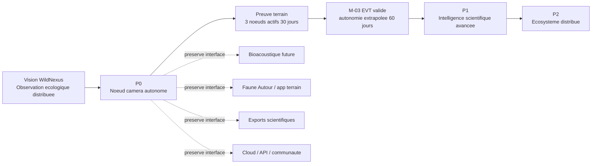
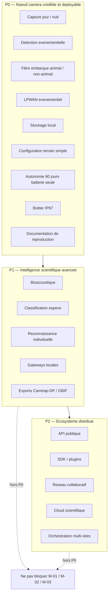
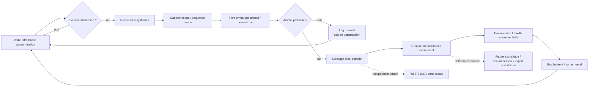
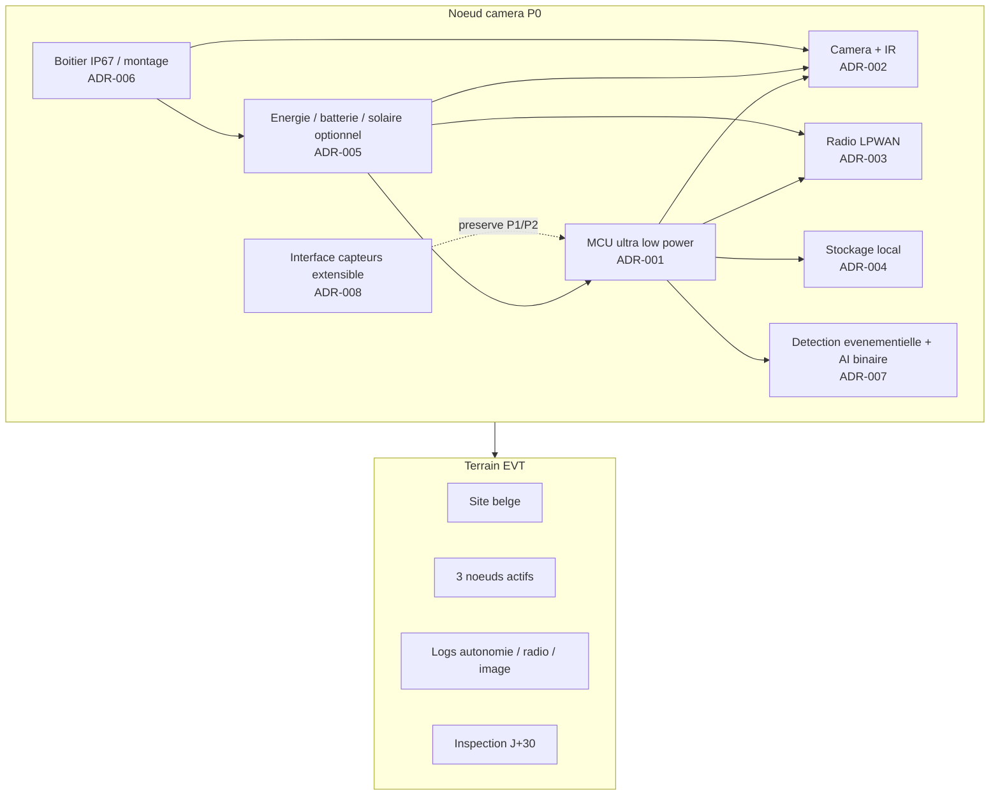
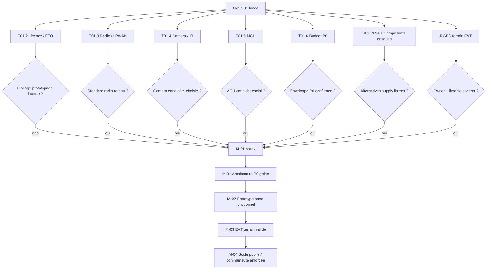
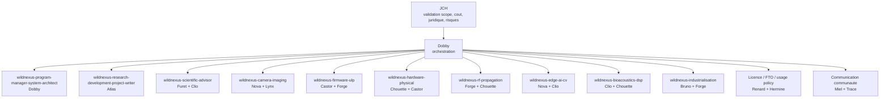

# WildNexus — Logigramme multi-etages

**Version :** v0.1  
**Date :** 2026-05-18  
**Statut :** interne — premiere carte de navigation  
**Owner :** Dobby  
**Contributeurs :** Atlas, Forge, Vega  

## Objet

Ce document fournit une carte logique de WildNexus a plusieurs niveaux de detail. Il distingue explicitement :

- le projet complet WildNexus ;
- le perimetre P0 strict ;
- les extensions P1/P2 a preserver sans les faire entrer dans P0 ;
- les decisions ouvertes qui conditionnent `M-01 Architecture P0 gelee`.

Sources principales :

- [INDEX.md](../INDEX.md)
- [WildNexus_MASTER_ARCHITECTURE.md](../01_FOUNDATION/WildNexus_MASTER_ARCHITECTURE.md)
- [wildnexus-founding-document-v0.2.md](../01_FOUNDATION/wildnexus-founding-document-v0.2.md)
- [WILDNEXUS_P0_SCOPE_LOCK.md](../01_FOUNDATION/WILDNEXUS_P0_SCOPE_LOCK.md)
- [WILDNEXUS_CYCLE_01_M01_READINESS.md](../00_GOVERNANCE/WILDNEXUS_CYCLE_01_M01_READINESS.md)
- [WILDNEXUS_ADR_INDEX.md](../02_DECISIONS/WILDNEXUS_ADR_INDEX.md)
- [WILDNEXUS_AGENT_MAPPING.md](../00_GOVERNANCE/WILDNEXUS_AGENT_MAPPING.md)

---

## Niveau 0 — Carte executive

Lecture en 2 minutes : WildNexus n'est pas un piege photo ameliore, mais une infrastructure distribuee d'observation ecologique. Le P0 doit prouver le noeud camera autonome avant d'ajouter la complexite scientifique.

---

## Niveau 1 — Phases et frontieres de scope

Ce niveau sert de garde-fou contre le scope creep. Les elements P1/P2 sont importants, mais ne doivent pas bloquer le prototype camera P0.

---

## Niveau 2 — Flux operationnel P0

Ce flux decrit le comportement attendu du noeud camera P0, depuis la veille energetique jusqu'a la recuperation des donnees.

---

## Niveau 3 — Architecture technique P0

Ce niveau separe les blocs qui devront faire l'objet d'ADR ou de specifications courtes avant `M-01`.

---

## Niveau 4 — Chemin de decision vers M-01

`M-01` est pret quand les decisions structurantes sont suffisamment documentees pour autoriser le prototype banc.

---

## Niveau 5 — Gouvernance et routage

Ce niveau clarifie qui pilote quoi. Les agents WildNexus produisent l'expertise domaine ; les specialistes PKA portent la qualite du livrable, la memoire et l'escalade.

---

## Lecture recommandee

1. Lire le **niveau 0** pour expliquer le projet.
2. Lire le **niveau 1** pour ne pas melanger P0, P1 et P2.
3. Lire le **niveau 2** pour comprendre ce que le noeud fait sur le terrain.
4. Lire le **niveau 3** avant de produire les ADR.
5. Lire le **niveau 4** pour piloter `M-01`.
6. Lire le **niveau 5** pour router les travaux sans recreer une seconde equipe.

## Prochaine iteration proposee

La version v0.2 devrait ajouter :

- un logigramme detaille par ADR ;
- un flux donnees minimum P0 avec les 12 champs du document fondateur ;
- une carte des risques activee par jalon ;
- une vue "presentation externe" plus simple, sans details internes PKA.
