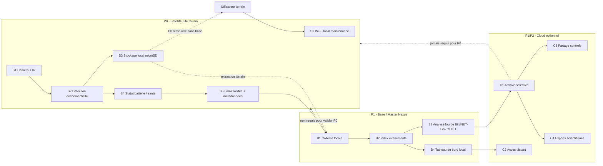

# WildNexus - Diagramme canonique Satellite / Base / Cloud

**Version :** v0.1  
**Date :** 2026-05-24  
**Statut :** source canonique  
**Scope :** WildNexus P0/P1/P2  
**Decision liee :** [ADR-009](../02_DECISIONS/ADR/[[ADR-009-architecture-satellite-base-cloud]].md)

## Objet

Ce fichier est la source texte canonique du schema Satellite / Base / Cloud.
Le rendu visuel stable est fourni par `diagramme.svg` ou `diagramme.png`.
Les hypotheses, limites et exceptions sont separees dans `diagramme-notes.md`.

## Diagramme

## Lecture rapide

- P0 valide d'abord un satellite terrain autonome.
- La Base/Master Nexus enrichit et orchestre en P1.
- Le Cloud reste optionnel et ne bloque jamais la validation P0.
