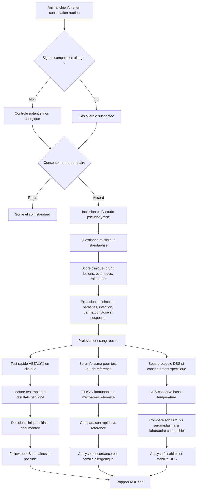
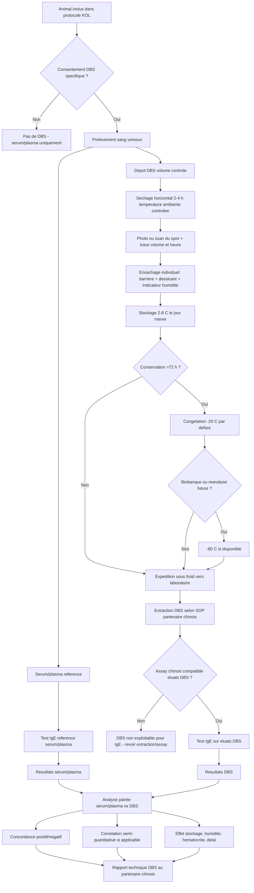
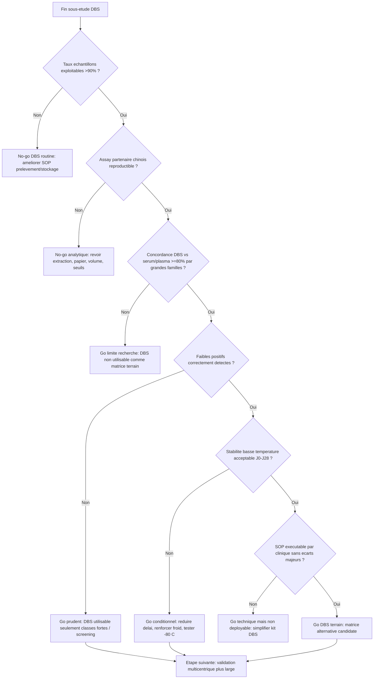

# VETALYX - Logigrammes validation clinique et DBS

## 1. Logigramme protocole clinique KOL

## 2. Logigramme sous-protocole DBS avec partenaire chinois

## 3. Logigramme decision go/no-go DBS

## 4. Notes d'utilisation

- Ces logigrammes doivent etre presentes comme support de discussion avec les KOL et le partenaire chinois.
- Le DBS est volontairement isole du flux principal : il s'agit d'un **sous-protocole analytique**, pas d'une condition de succes du test rapide.
- Le serum/plasma reste la reference obligatoire tant que le pontage DBS n'est pas valide.
- Les seuils DBS ne doivent pas etre supposes identiques aux seuils serum/plasma.
