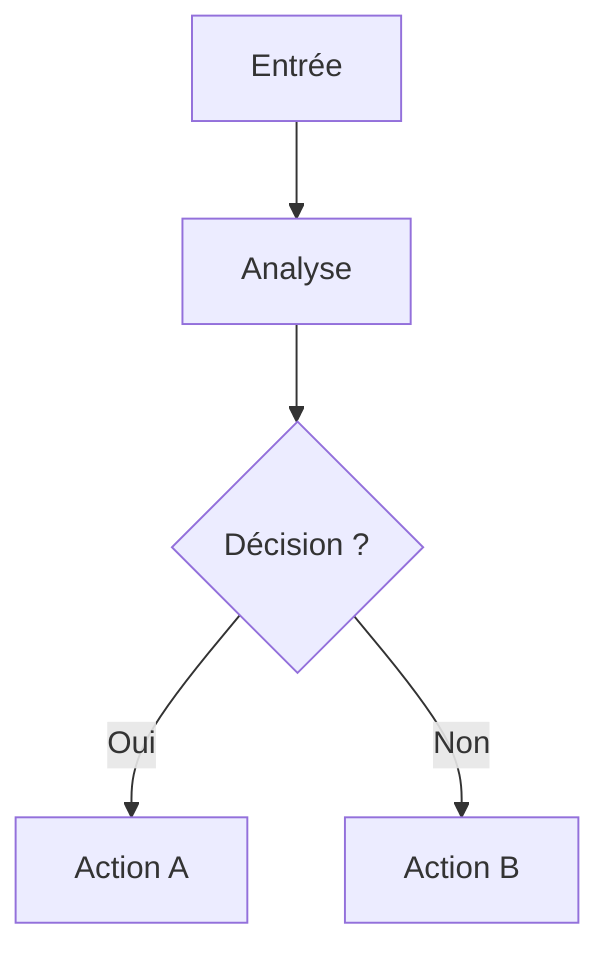

# Diagramming Standard

**Version :** v1.0  
**Statut :** actif  
**Scope :** PKA_JCH, tous projets

## Objectif

Rendre les croquis et logigrammes lisibles par un humain et réinterprétables par un assistant sans ambiguite.

Le principe est simple :

- le texte porte la logique ;
- l'image porte la forme ;
- les notes portent les hypotheses.

## Format standard

Chaque schéma doit idéalement exister sous trois formes :

1. `diagramme.md`
   - source canonique
   - Mermaid ou PlantUML
   - versionnable et diffable

2. `diagramme.svg` ou `diagramme.png`
   - rendu visuel
   - utile pour partage rapide

3. `diagramme-notes.md`
   - but du schéma
   - légende des blocs
   - hypothèses
   - exceptions
   - questions ouvertes

## Règles de lecture

- Un bloc = une idée.
- Un identifiant stable par bloc : `A1`, `A2`, `D1`, `S1`.
- Une décision doit être un losange et avoir des sorties nommées.
- Une flèche doit exprimer un sens clair.
- Les libellés doivent rester courts.
- Les abréviations non triviales doivent être définies dans les notes.
- Le texte manuscrit dans une image ne doit jamais être la seule source d'information.

## Nommage

Convention recommandée :

- `diagramme.md`
- `diagramme.svg`
- `diagramme-notes.md`

Pour un ensemble de schémas liés :

- `architecture.md`
- `architecture-notes.md`
- `architecture.png`

## Gabarit Mermaid



## Gabarit de notes

```md
# Titre

## But
Décrire ...

## Blocs
- A1 : ...
- A2 : ...
- D1 : ...

## Règles
- Si X alors Y
- Sinon aller vers Z

## Hypothèses
- ...

## Questions ouvertes
- ...
```

## Bonnes pratiques

- Préférer les schémas texte quand la logique doit être relue ou modifiée.
- Utiliser SVG quand le dessin compte visuellement.
- Garder la légende dans un fichier séparé si le schéma devient dense.
- Éviter de mélanger plusieurs niveaux de détail dans un seul dessin.
- Si un schéma sert à décider, il doit pouvoir être lu sans le contexte de la conversation d'origine.

## Usage recommandé dans PKA_JCH

- `WildNexus` : flowmaps, ADR, architecture, flux terrain.
- `Arteon` : workflows éditoriaux, production, publication.
- `Nuances` : logigrammes de mission et dépendances.
- Tout autre projet : même règle, adaptation minimale.
